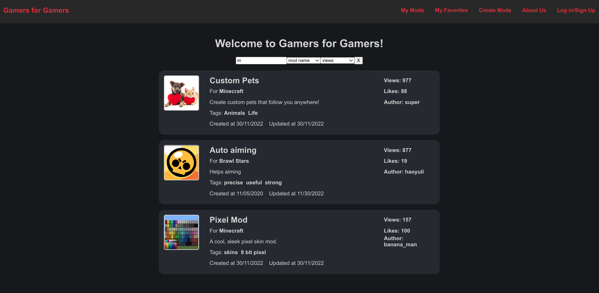

# Gamers for Gamers: CS35L Project



Gamers For Gamers (GFG) is a community driven video game modding content sharing website. You can browse, search, favorite, comment, and view the mod contents created by the gaming community. Meanwhile, you can also be a creator to share your wonderful contents to the community. 

[Presentation Slides](https://docs.google.com/presentation/d/1sCE8nqiZmZcsDqKnU30e6MoekDZ3dp1qeGLRXvcgids/edit?usp=sharing)

[Demo Video](https://drive.google.com/drive/folders/1mPaurEwQ608CxPPRdEnrZx9XfvSds3Xs?usp=share_link)

## Build

- Install Node if you have not
```
brew install node
```

- Clone this repo
```
git clone https://github.com/TraderBros-UCLA/ucla-22f-35l-project.git
```

- Go to your cloned directory, then install node packages
```
cd frontend ; npm install ; cd ..
cd backend; npm install ; cd ..
```

## Install MongoDB Database

### MacOS

- Install MongoDB Community 6.0: [Official Guide](https://www.mongodb.com/docs/manual/installation/)
- For easy installation, we recommend [Homebrew](https://brew.sh/)
```
brew tap mongodb/brew
brew update
brew install mongodb-community@6.0
```

### Windows
- Install MongoDB Community 6.0 for Windows: [Official Guide](https://www.mongodb.com/docs/manual/installation/)
- Follow the procedure in the official guide to install it on your specific machine.

### Linux
- Install MongoDB Community 6.0 for Linux: [Official Guide](https://www.mongodb.com/docs/manual/installation/)
- Follow the procedure in the official guide to install it on your specific machine.

## Start Database

### MacOS
```
# To start database:
brew services start mongodb-community@6.0
# To shutdown database:
brew services stop mongodb-community@6.0
```
### Windows
Click the .exe executable of mongodb. For details, check installation guide above.

### Linux
For details, check installation guide above.

## Load Sample Database

Our application is at its core a content driven website. 
To view its full functions in limited time, we have provided
some sample data for you to load as default content. 

To load them, run the script `load-sample-data.sh` in
your shell and it should automatically fill the database
(make sure you started it already) with sample data.

## Run Server
Start up server instance on http://localhost:3030
```
node backend
```

## Run Client
Start up client instance on http://localhost:3000
```
cd frontend
npm start
```